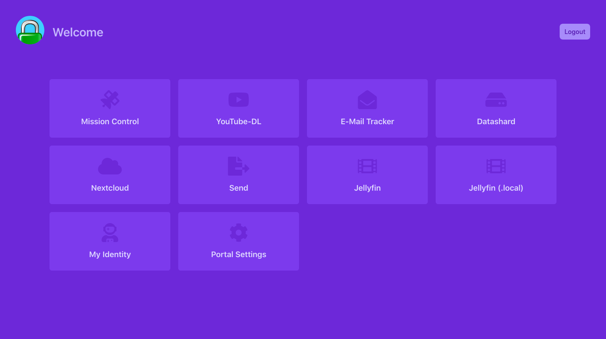
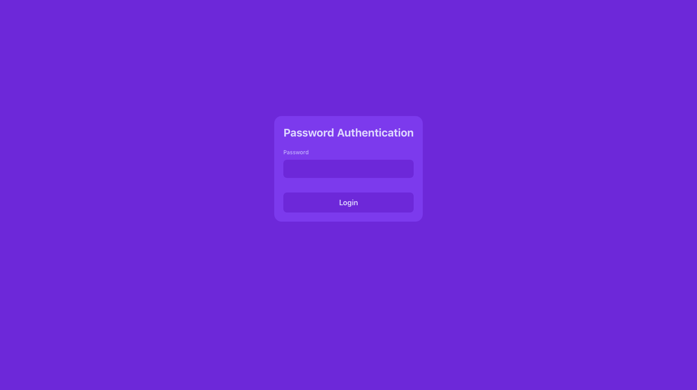
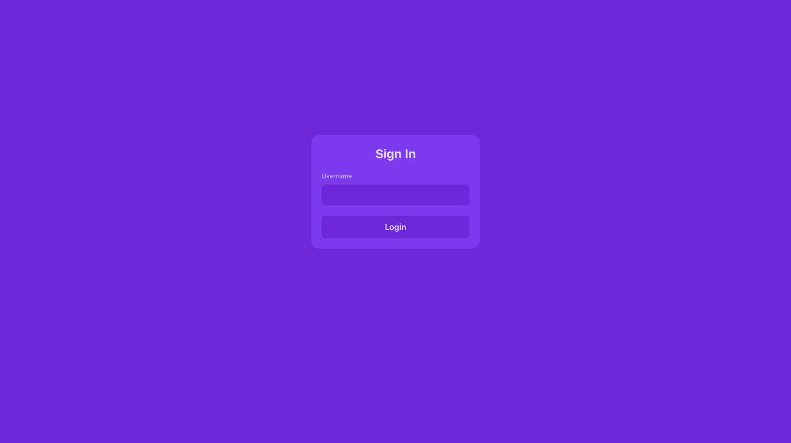

# Custom caddy-security template
> My personal customized caddy-security template, built with [Tailwind](tailwindcss.com/)

## How to use
Clone the repository to somewhere on your machine.

```bash
git clone https://github.com/Capevace/custom-caddy-template custom-template
```

And add the following to your Caddyfile security section:

```
{
	...

	security {
		authentication portal myPortal {
			ui {
        			...
				
        
        			template generic "/PATH/TO/custom-template/templates/generic.template"
				template portal "/PATH/TO/custom-template/templates/portal.template"
				template login "/PATH/TO/custom-template/templates/login.template"
				template sandbox "/PATH/TO/custom-template/templates/sandbox.template"
				custom css path "/PATH/TO/custom-template/css/output.css"
				
				
				...
			}
      		}
	}
}
      
...
```

## Screenshot


